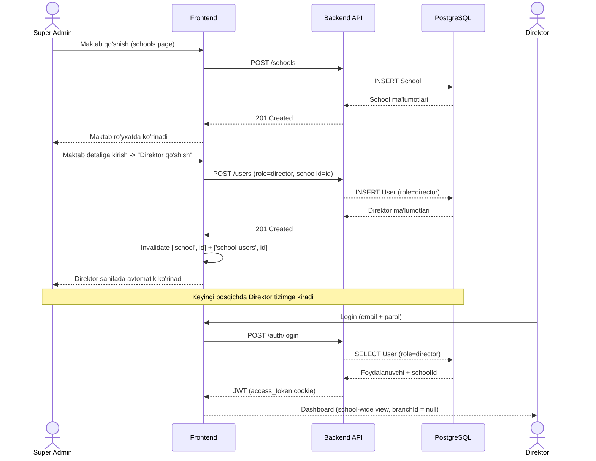
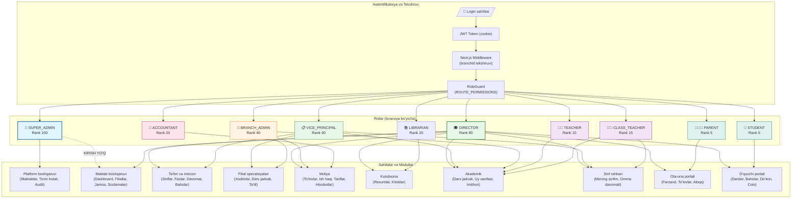
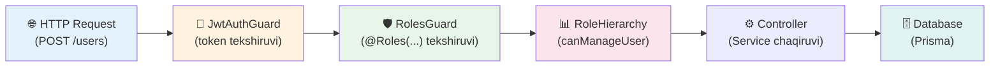
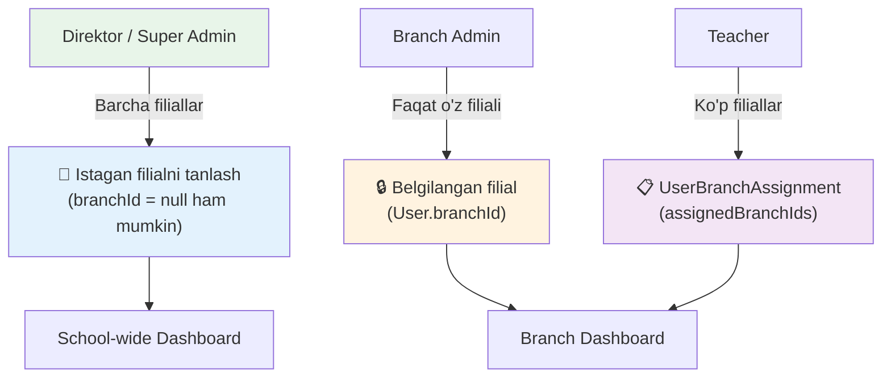

# Xedu — Rollar bo‘yicha ish oqimi (Mermaid Diagrammalar)

Ushbu hujjatda loyihaning asosiy foydalanuvchi rollari, ularning huquqlari va ma’lumotlar oqimi Mermaid diagrammalari orqali tasvirlangan.

---

## 1. Super Admin → Maktab → Direktor (Asosiy Flow)

Bu diagramma Super Admin tomonidan maktab yaratish, unga direktor tayinlash va tizimga kirish jarayonini ko‘rsatadi.



---

## 2. Direktor ish oqimi (Dashboard dan boshlab)

```mermaid
flowchart TD
    subgraph DirektorPanel["Direktor Dashboard"]
        D[Direktor Kirish]
        D --> DASH["📊 Umumiy ko‘rinish<br/>(KPI, Statistika)"]
        D --> BR["🏢 Filiallar<br/>(CRUD — yaratish, tahrirlash, o‘chirish)"]
        D --> USR["👥 Jamoa<br/>(Xodimlar, Foydalanuvchilar)"]
        D --> EDU["📚 Ta'lim<br/>(Sinflar, Fanlar, Dars jadvali, Akademik kalendar)"]
        D --> FIN["💰 Moliya<br/>(To‘lovlar, Tariflar, Ish haqi)"]
        D --> REP["📈 Hisobotlar<br/>(Davomat, Baholar, Moliyaviy)"]
        D --> DIS["⚠️ Intizom<br/>(Jazo, Ogohlantirishlar)"]
        D --> SET["⚙️ Sozlamalar"]
    end

    BR --> BA["Filial Admin tayinlash"]
    USR --> VP["Zam Direktor (Vice Principal)"]
    USR --> ACC["Hisobchi (Accountant)"]
    USR --> TCH["O‘qituvchi (Teacher)"]
    USR --> LIB["Kutubxonachi (Librarian)"]
    EDU --> CLS["Sinf rahbari (Class Teacher)"]
    EDU --> STD["O‘quvchi qo‘shish"]
    FIN --> PAY["Ota-onalar to‘lovlari"]
    REP --> ATT["Davomat hisobotlari"]
    REP --> GRD["Baholar hisobotlari"]

    style D fill:#e8f5e9,stroke:#2e7d32,stroke-width:2px
    style DASH fill:#e3f2fd
    style BR fill:#fff3e0
    style USR fill:#fce4ec
    style EDU fill:#f3e5f5
    style FIN fill:#e0f2f1
    style REP fill:#e8eaf6
```



---

## 3. Barcha rollar ierarhiyasi va huquqlari



---

## 4. Ma’lumotlar modeli (School ↔ Branch ↔ User)

```mermaid
erDiagram
    SCHOOL ||--o{ BRANCH : "has many"
    SCHOOL ||--o{ USER : "has many"
    BRANCH ||--o{ USER : "has many"
    BRANCH ||--o{ CLASS : "has many"
    USER ||--o{ USER_BRANCH_ASSIGNMENT : "optional many"
    USER_BRANCH_ASSIGNMENT }o--|| BRANCH : "belongs to"

    SCHOOL {
        string id PK
        string name
        string address
        string phone
        string email
        datetime createdAt
        datetime updatedAt
    }

    BRANCH {
        string id PK
        string name
        string schoolId FK
        string address
        datetime createdAt
    }

    USER {
        string id PK
        string firstName
        string lastName
        string email
        string phone
        UserRole role
        string password
        string schoolId FK "nullable (super_admin)"
        string branchId FK "nullable (director)"
        datetime createdAt
    }

    USER_BRANCH_ASSIGNMENT {
        string userId PK,FK
        string branchId PK,FK
        UserRole branchRole
        datetime assignedAt
    }

    CLASS {
        string id PK
        string name
        string schoolId FK
        string branchId FK
        string teacherId FK
    }
```

---

## 5. Backend avtorizatsiya oqimi (API so‘rovi)



---

## 6. Filial almashish (Branch Switch) logikasi



---

## 7. Key Files (Muhim fayllar)

| Maqsad | Yo‘l |
|---|---|
| **Shared Role Enum** | `packages/types/src/enums.ts` |
| **Frontend Permissions SSOT** | `apps/frontend/src/config/permissions.ts` |
| **Frontend Navigation/Sidebar** | `apps/frontend/src/config/navigation.ts` |
| **Frontend Middleware** | `apps/frontend/src/middleware.ts` |
| **Frontend Role Guard** | `apps/frontend/src/components/auth/role-guard.tsx` |
| **Backend Roles Decorator** | `apps/backend/src/common/decorators/roles.decorator.ts` |
| **Backend Roles Guard** | `apps/backend/src/common/guards/roles.guard.ts` |
| **Backend Role Hierarchy** | `apps/backend/src/common/utils/role-hierarchy.util.ts` |
| **Prisma Schema** | `apps/backend/prisma/schema.prisma` |
| **Auth Service** | `apps/backend/src/modules/auth/auth.service.ts` |
